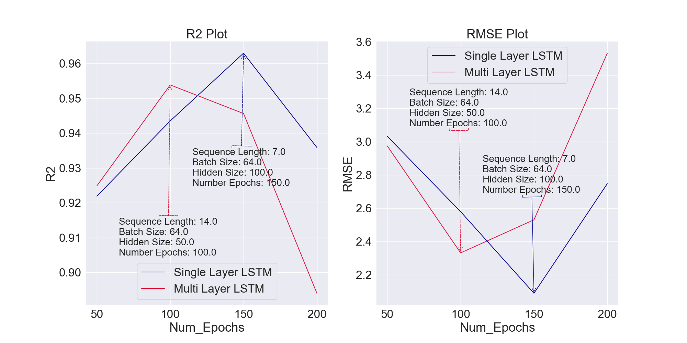
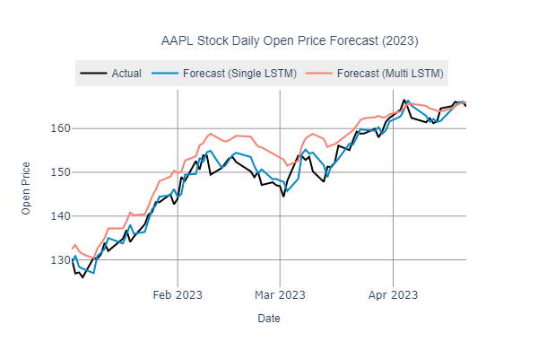
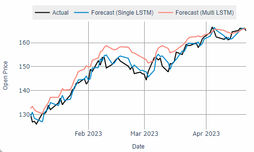

# Stock Price Forecast with LSTM 
### Goal:
- Forecast AAPL stock with LSTM
- Determine if model architecture complexity could improve prediction performance

### Steps:
1. Extract the latest yahoo finance data  
2. Tune the Hyperparameter and Test Performance[skip this step unless intend to train a new model]  
    2.1 Train the single lstm and multi lstm with combination of hyperparameters to determine the optimal parameter for stock price prediction   
    2.2. Visualize the training results to determine the optimum parameters for single lstm and multi lstm  
3. Set the parameters for single layer lstm and multi layer lstm and train and test on the latest stock price data from yahoo finance  
4. The stock price prediction results stored in csv file will be visualize by hostX_X.py file 

### Optimal Hyperparameters for Each Model
</img> 
 
 

### Forecasting Result from Each Model
**Conclusion: Single layer LSTM outperformed Multi layer LSTM**
 
 
</img> 
 
 
</img> 
 
 
